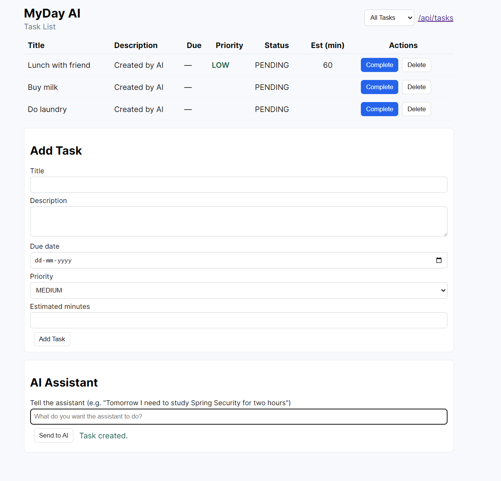

# MyDay AI 🤖

> An AI-powered personal task manager that understands natural language and takes actions on your behalf.

MyDay AI is a Spring Boot backend that combines an LLM with deterministic task-management tools to turn natural-language requests into real actions.

Instead of interacting with a traditional CRUD interface, users can simply say:

- "Buy milk"
- "Study Java for 2 hours tomorrow"
- "Show me my tasks for today"
- "Mark buy milk as complete"
- "Change buy milk to buy almond milk"
- "Delete my grocery task"

The AI interprets the request, determines the required action, extracts the relevant parameters, and the backend executes the operation against the database.

---

## ✨ What makes this different?

Traditional task managers require users to explicitly interact with CRUD operations.

MyDay AI provides a natural-language interface on top of those operations.

```text
User
  │
  │ "Study Java for 2 hours tomorrow"
  ▼
┌──────────────────────┐
│     AI Interpreter   │
│                       │
│ Determines intent     │
│ Extracts parameters   │
└──────────┬───────────┘
           │
           ▼
{
  "action": "createTask",
  "title": "Study Java",
  "dueDate": "tomorrow",
  "estimatedMinutes": 120
}
           │
           ▼
┌──────────────────────┐
│    Tool Execution     │
│                       │
│ TaskToolService        │
└──────────┬───────────┘
           │
           ▼
┌──────────────────────┐
│     TaskService        │
│                       │
│ Business validation    │
└──────────┬───────────┘
           │
           ▼
┌──────────────────────┐
│     Database           │
└──────────────────────┘
```

The LLM **does not directly modify the database**.

It only determines the user's intent and produces structured action parameters.

The Spring Boot backend remains responsible for validation, business logic, and persistence.

---

## 🚀 Features

### Natural Language Task Creation

Create tasks using conversational language.

```text
"Buy milk"
```

```text
"Study Java for 2 hours tomorrow"
```

The AI extracts:

```json
{
  "action": "createTask",
  "title": "Study Java",
  "dueDate": "tomorrow",
  "estimatedMinutes": 120
}
```

### Task Updates

Modify existing tasks using natural language.

```text
"Change buy milk to buy almond milk"
```

The agent identifies the existing task and updates it.

### Task Completion

```text
"Mark buy milk as complete"
```

The agent finds the corresponding task and marks it as:

```text
COMPLETED
```

while recording the completion timestamp.

### Task Deletion

```text
"Delete buy almond milk"
```

The agent identifies the matching task and deletes it.

### Task Listing

```text
"Show me my tasks"
"What are my tasks today?"
"Show tomorrow's tasks"
"What tasks are overdue?"
```

Supported filters:

- All
- Today
- Tomorrow
- Overdue

---

## 🧠 Supported Agent Actions

| Action         | Description                      |
| -------------- | --------------------------------- |
| `createTask`   | Creates a new task                |
| `updateTask`   | Updates an existing task          |
| `deleteTask`   | Deletes an existing task          |
| `completeTask` | Marks a task as completed         |
| `listTasks`    | Retrieves tasks based on filters  |
| `none`         | No task-related action required   |

---

## 🏗️ Architecture

```text
                    ┌─────────────────┐
                    │      User        │
                    └────────┬────────┘
                             │
                             ▼
                  ┌─────────────────────┐
                  │   AgentController    │
                  │                       │
                  │ POST /api/agent/...   │
                  └──────────┬──────────┘
                             │
                             ▼
                  ┌─────────────────────┐
                  │      AiService        │
                  │                       │
                  │ LLM Integration        │
                  └──────────┬──────────┘
                             │
                             ▼
                       ┌───────────┐
                       │   Groq     │
                       │    LLM     │
                       └─────┬─────┘
                             │
                     Structured JSON
                             │
                             ▼
                  ┌─────────────────────┐
                  │   AgentController     │
                  │ Action Dispatcher      │
                  └──────────┬──────────┘
                             │
              ┌──────────────┼──────────────┐
              │              │              │
              ▼              ▼              ▼
        createTask     updateTask      deleteTask
              │              │              │
              └──────────────┼──────────────┘
                             │
                     ┌───────▼────────┐
                     │ TaskToolService │
                     └───────┬────────┘
                             │
                     ┌───────▼────────┐
                     │   TaskService   │
                     │ Business Logic  │
                     └───────┬────────┘
                             │
                     ┌───────▼────────┐
                     │ TaskRepository  │
                     │ Spring Data JPA │
                     └───────┬────────┘
                             │
                             ▼
                         Database
```

---

## 🔑 Key Design Principle

The project follows an important separation of responsibilities:

**LLM** is responsible for:
- Understanding natural language
- Identifying user intent
- Extracting task parameters
- Returning structured JSON

**Spring Boot** is responsible for:
- Action execution
- Business validation
- Finding existing tasks
- Database operations
- Error handling
- Data persistence

This prevents the LLM from directly controlling application state.

---

## 🛠️ Tech Stack

**Backend**
- Java
- Spring Boot
- Spring Web
- Spring Data JPA
- Hibernate
- REST APIs

**AI**
- Groq API
- Large Language Model
- Structured JSON-based intent extraction

**Database**
- Relational database
- JPA/Hibernate persistence

**Development**
- IntelliJ IDEA
- Maven
- Git
- GitHub

---

## 📂 Project Structure

```text
src
└── main
    └── java
        └── com.ayushi.DailyTaskManagementSystem
            │
            ├── controller
            │   ├── AgentController.java
            │   └── TaskController.java
            │
            ├── model
            │   └── Task.java
            │
            ├── service
            │   ├── AiService.java
            │   ├── TaskService.java
            │   └── TaskToolService.java
            │
            └── TaskRepository.java
```

---

## 🔌 API

### Interpret a user request

```http
POST /api/agent/interpret
Content-Type: application/json
```

Request:

```json
{
  "text": "Study Java for 2 hours tomorrow"
}
```

Response:

```json
{
  "action": "createTask",
  "task": {
    "id": 1,
    "title": "Study Java",
    "status": "PENDING",
    "dueDate": "2026-08-20",
    "estimatedMinutes": 120
  }
}
```

---

## 📋 Task Model

A task contains:

```text
id
title
description
status
priority
dueDate
estimatedMinutes
createdAt
completedAt
```

Example:

```json
{
  "id": 1,
  "title": "Study Java",
  "description": "Created by AI",
  "status": "PENDING",
  "priority": "HIGH",
  "dueDate": "2026-08-20",
  "estimatedMinutes": 120,
  "createdAt": "...",
  "completedAt": null
}
```

---

## 🧩 How the Agent Works

For a request such as:

```text
"Move my Java study task to tomorrow"
```

**Step 1 — User Request**
The backend receives the natural-language request.

**Step 2 — LLM Interpretation**
The LLM identifies:

```text
Action: updateTask
Task: Java study
New due date: tomorrow
```

**Step 3 — Structured Output**

```json
{
  "action": "updateTask",
  "taskQuery": "Java study",
  "title": "",
  "dueDate": "tomorrow",
  "estimatedMinutes": 0,
  "priority": "",
  "description": ""
}
```

**Step 4 — Task Resolution**
The Java backend searches existing tasks for the requested task.

**Step 5 — Business Logic**
`TaskService` validates the update.

**Step 6 — Persistence**
Spring Data JPA persists the updated task.

---

## 🔐 Why the LLM Doesn't Directly Modify Data

The LLM produces an instruction rather than directly executing database operations.

```text
LLM
 ↓
Structured intent
 ↓
Java validation
 ↓
Tool service
 ↓
Business service
 ↓
Database
```

This makes the system easier to validate, test, debug, extend, and secure. It also allows the AI layer to be replaced without rewriting the task-management business logic.

---

## 🧪 Example Requests

| User Request                  | Agent Action    |
| ------------------------------ | ---------------- |
| Buy milk                       | `createTask`     |
| Buy groceries tomorrow         | `createTask`     |
| Study Java for 2 hours         | `createTask`     |
| Change buy milk to buy eggs    | `updateTask`     |
| Move study Java to tomorrow    | `updateTask`     |
| Mark laundry complete          | `completeTask`   |
| Delete grocery task            | `deleteTask`     |
| Show my tasks                  | `listTasks`      |
| What are my tasks today?       | `listTasks`      |
| How do I learn Spring Boot?    | `none`           |
| Tell me a joke                 | `none`           |

---

## ⚙️ Running Locally

### Prerequisites

- Java 17+
- Maven
- A relational database
- Groq API key

### Configure API Key

Set the Groq API key as an environment variable.

```text
GROQ_API_KEY=your_api_key
```

Do not commit API keys to GitHub.

### Start the application

```bash
mvn spring-boot:run
```

The API will be available at:

```text
http://localhost:8080
```

---

## 🗺️ Roadmap

**V1 — Core Agent**
- [x] Natural language task creation
- [x] Task updates
- [x] Task deletion
- [x] Task completion
- [x] Task listing
- [x] LLM intent extraction
- [x] Structured JSON responses
- [x] Separation between AI and business logic

**V2 — Smarter Task Resolution**
- [ ] Better fuzzy task matching
- [ ] Handle ambiguous task names
- [ ] Confirmation before destructive actions
- [ ] Conversation context
- [ ] Task search

**V3 — Personal Productivity Agent**
- [ ] Priority inference
- [ ] Automatic task categorization
- [ ] Daily planning
- [ ] Task recommendations
- [ ] Time-aware scheduling
- [ ] Natural-language daily summaries

**V4 — Multi-tool AI Agent**

Potential tools:
```text
Task Tool
Calendar Tool
Reminder Tool
Notes Tool
Weather Tool
Email Tool
```

The goal is to evolve MyDay AI from a natural-language task manager into a general-purpose personal action agent.

---

## 🎯 Project Goals

The project is designed to explore how LLMs can be integrated into conventional backend systems without allowing the model to directly control application state.

The core idea is:

> **LLMs interpret. Backend services execute.**

This architecture allows AI capabilities to be added while maintaining conventional software-engineering principles such as separation of concerns, validation, persistence, and deterministic business logic.

